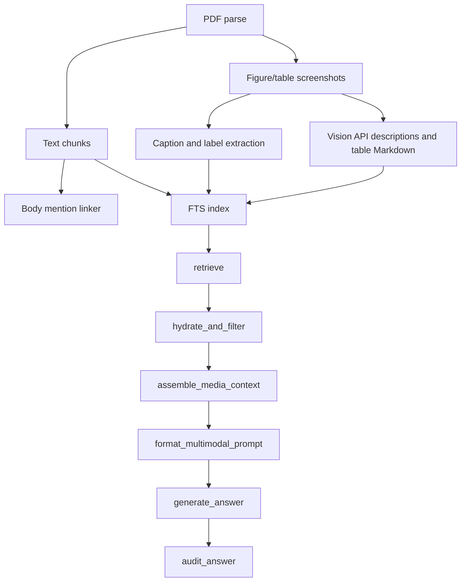

# LangGraph Multimodal RAG Refactor Plan

Date: 2026-06-02

## Goal

Refactor Mnemosyne / KnowCran into a figure/table-aware, low-memory, multimodal RAG system using LangGraph.

The system should keep the existing embedding provider support, reduce memory pressure through FTS-prefiltered hybrid retrieval, and add a strict evidence boundary:

- PDF body text, physical figure/table captions, and original screenshots can be used as evidence.
- Vision API generated table Markdown and VLM descriptions can be used for retrieval and auxiliary explanation.
- Machine generated visual text must not be treated as physical PDF evidence.

## Current Project Context

Relevant existing files:

- `knowcran/fulltext.py`: PDF download, parsing orchestration, chunk insertion, embedding generation, FTS/hybrid search.
- `knowcran/storage.py`: SQLite schema, parsed document storage, chunk storage, embedding storage, FTS search.
- `knowcran/parsers/mineru.py`: MinerU API parsing into `ParsedElement`.
- `knowcran/parsers/pymupdf.py`: PyMuPDF fallback parser.
- `knowcran/parsers/chunker.py`: layout-aware text chunking.
- `knowcran/embeddings.py`: OpenAI-compatible/local embedding provider.
- `knowcran/server/mcp.py`: MCP handlers.
- `knowcran/server/tools.py`: MCP tool definitions.
- `knowcran/cli.py`: CLI commands.

Important constraints:

- Keep `EmbeddingProvider` and the existing `openai`, `local`, and `none` modes.
- Avoid loading all stored embedding BLOBs into memory during query.
- Use OpenAI-compatible vision/chat APIs for Mimo, Kimi, Qwen, DeepSeek, or similar providers.
- Provider health routing should refresh on failure, not by constant polling.
- Accept Vision API generated Markdown for tables, but label it as machine extracted.

## Scope

In scope:

- Figure and table screenshot extraction.
- Table OCR / Markdown extraction through Vision API.
- Figure/table label matching with captions and body references.
- VLM descriptions for retrieval and auxiliary display.
- OpenAI-compatible multimodal provider layer.
- Failure-triggered provider health refresh and fallback.
- LangGraph RAG query flow.
- FTS-prefiltered hybrid retrieval.
- CLI and MCP entry points for multimodal RAG.
- Tests for evidence isolation, provider fallback, and memory-safe retrieval.

Out of scope:

- Removing existing embedding support.
- Running a local multimodal model as a required service.
- Treating VLM descriptions or Vision-generated table Markdown as physical PDF text.
- Rewriting the PDF downloader.
- Replacing SQLite with a dedicated vector database in the first pass.

## Target Architecture



## Evidence Contract

Each retrieved item must preserve a source type.

Allowed source types:

- `physical_text`: text physically extracted from the PDF body.
- `physical_caption`: caption physically extracted from the PDF near a figure/table.
- `original_media`: screenshot of a figure/table extracted from the PDF.
- `machine_extracted_table`: Markdown or OCR text generated from a table screenshot by a Vision API.
- `auxiliary_interpretation`: VLM description of a figure/table.

Generation rules:

- The answer may cite `physical_text`, `physical_caption`, and `original_media`.
- `machine_extracted_table` and `auxiliary_interpretation` may be shown as auxiliary interpretation only.
- If machine output conflicts with physical text/caption/original screenshot, prefer the physical source.
- The final response should expose the source type for every cited item.

## Data Model Changes

Modify `knowcran/storage.py`.

Add `parsed_media_assets`:

```sql
CREATE TABLE IF NOT EXISTS parsed_media_assets (
    media_id TEXT PRIMARY KEY,
    paper_id TEXT NOT NULL,
    asset_id TEXT NOT NULL,
    media_type TEXT NOT NULL,
    figure_label TEXT,
    caption_text TEXT,
    image_path TEXT NOT NULL,
    page_number INTEGER,
    bbox TEXT,
    ocr_text TEXT,
    markdown_table TEXT,
    extraction_method TEXT,
    confidence REAL,
    created_at TEXT NOT NULL
);
```

Add `media_mentions`:

```sql
CREATE TABLE IF NOT EXISTS media_mentions (
    mention_id TEXT PRIMARY KEY,
    media_id TEXT NOT NULL,
    chunk_id TEXT NOT NULL,
    paper_id TEXT NOT NULL,
    mention_text TEXT NOT NULL,
    created_at TEXT NOT NULL
);
```

Add `media_vlm_descriptions`:

```sql
CREATE TABLE IF NOT EXISTS media_vlm_descriptions (
    description_id TEXT PRIMARY KEY,
    media_id TEXT NOT NULL,
    provider TEXT NOT NULL,
    model TEXT NOT NULL,
    prompt_hash TEXT,
    description_text TEXT NOT NULL,
    source_type TEXT NOT NULL DEFAULT 'auxiliary_interpretation',
    status TEXT NOT NULL,
    error TEXT,
    created_at TEXT NOT NULL
);
```

Add indexes:

- `idx_media_assets_paper_id`
- `idx_media_assets_label`
- `idx_media_mentions_media_id`
- `idx_media_mentions_chunk_id`
- `idx_media_vlm_media_id`

Add helper methods:

- `insert_parsed_media_assets`
- `get_media_asset`
- `get_media_for_paper`
- `insert_media_mentions`
- `get_media_mentions`
- `insert_media_vlm_description`
- `get_media_context`

## Parser Changes

Modify `knowcran/parsers/mineru.py`.

MinerU parsing should:

- Preserve existing text parsing.
- Detect `image`, `figure`, and `table` elements when present.
- Save screenshot/image path for each figure/table.
- Preserve `caption_text`, `page_idx`, and `bbox`.
- Normalize labels such as `Figure 1`, `Fig. 1`, `图1`, `Table 1`, `表1`.

Add PyMuPDF fallback helpers:

- Locate likely captions on a page using figure/table label regex.
- Crop nearby page regions when MinerU does not provide image/table assets.
- Save screenshots under `data/media/<paper_id>/`.
- For tables, store the screenshot even if Markdown extraction fails.

Recommended new module:

- `knowcran/media/extract.py`
- `knowcran/media/linker.py`
- `knowcran/media/table_markdown.py`

## Vision API Provider

Add OpenAI-compatible provider support under:

- `knowcran/vision/provider.py`
- `knowcran/vision/router.py`
- `knowcran/vision/prompts.py`

Configuration:

```text
MNEMOSYNE_VISION_PROVIDERS=mimo,kimi,qwen,deepseek
MNEMOSYNE_VISION_MIMO_API_BASE=
MNEMOSYNE_VISION_MIMO_API_KEY=
MNEMOSYNE_VISION_MIMO_MODEL=
MNEMOSYNE_VISION_KIMI_API_BASE=
MNEMOSYNE_VISION_KIMI_API_KEY=
MNEMOSYNE_VISION_KIMI_MODEL=
MNEMOSYNE_VISION_QWEN_API_BASE=
MNEMOSYNE_VISION_QWEN_API_KEY=
MNEMOSYNE_VISION_QWEN_MODEL=
MNEMOSYNE_VISION_DEEPSEEK_API_BASE=
MNEMOSYNE_VISION_DEEPSEEK_API_KEY=
MNEMOSYNE_VISION_DEEPSEEK_MODEL=
```

Provider behavior:

- Use OpenAI-compatible chat/completions or responses-style payloads as supported by the endpoint.
- Accept local image paths and encode as data URLs.
- Support two task types:
  - `describe_media`: figure/table visual description.
  - `table_to_markdown`: table screenshot to Markdown.
- Return structured metadata: provider, model, status, error, source type.

Health routing:

- Use configured provider order by default.
- On request failure, mark provider unhealthy and refresh health.
- Immediately retry with the next healthy provider.
- Do not run constant background polling.
- Optionally persist health state in `data/runtime/vision_provider_health.json`.

## Retrieval Changes

Modify `knowcran/fulltext.py` or add `knowcran/rag/retrieval.py`.

Add `fts_prefiltered_hybrid`:

1. Search FTS5 over text chunks and media index text.
2. Select top candidate IDs only.
3. Use the existing `EmbeddingProvider` to embed the query.
4. Load embeddings only for candidate chunks/media index entries.
5. Rerank candidates.

Do not pull all topic embeddings into memory.

Indexable retrieval text:

- Chunk physical text.
- Physical captions.
- Vision-generated table Markdown.
- VLM auxiliary descriptions.
- Body mentions linked to media.

Each indexed row must carry:

- `source_id`
- `source_type`
- `paper_id`
- `chunk_id` or `media_id`
- `page_number`
- `title`
- `citation_key` when available

## LangGraph RAG Flow

Add package:

```text
knowcran/rag/
  __init__.py
  state.py
  graph.py
  retrieval.py
  hydrate.py
  prompts.py
  generator.py
  audit.py
```

State shape:

```python
class AgentState(TypedDict):
    query: str
    topic: str | None
    paper_id: str | None
    raw_retrieved: list[dict[str, Any]]
    context_texts: list[dict[str, Any]]
    context_media: list[dict[str, Any]]
    auxiliary_context: list[dict[str, Any]]
    formatted_prompt: Any
    final_response: str
    audit: dict[str, Any]
```

Nodes:

- `retrieve`: perform FTS-prefiltered hybrid search and return IDs plus metadata.
- `hydrate_and_filter`: look up real chunks/media from SQLite and separate physical evidence from machine text.
- `assemble_media_context`: attach caption, body mentions, screenshot, Markdown table, VLM description.
- `format_multimodal_prompt`: build a multimodal prompt with explicit source sections.
- `generate_answer`: call the OpenAI-compatible vision/chat provider.
- `audit_answer`: reuse existing answer audit logic and add media source-type checks.

Conditional routing:

- If `context_media` is non-empty, use multimodal generation.
- If no media is present, use text-only generation through the same provider interface.

## Prompt Contract

The prompt must clearly separate:

1. PDF physical text evidence.
2. Physical captions.
3. Original figure/table screenshots.
4. Machine-extracted table Markdown.
5. Auxiliary VLM descriptions.

Required instruction:

```text
Use PDF physical text, physical captions, and original screenshots as evidence.
Use machine-extracted tables and VLM descriptions only as auxiliary interpretation.
If auxiliary text conflicts with physical sources, trust the physical sources.
When answering, identify whether each cited support is physical text, caption, original media, machine table extraction, or auxiliary interpretation.
```

## CLI And MCP

Add CLI command:

```bash
knowcran ask-rag "question" --topic "topic" --limit 10
```

Add MCP tool:

- `knowcran_answer_rag`

Tool output should include:

- `answer`
- `citations`
- `chunks`
- `media`
- `machine_extracted_tables`
- `auxiliary_interpretations`
- `audit`
- `degraded_reason` when provider fallback or embedding degradation occurred

## Tests

Add or extend tests:

- `tests/test_media_extraction.py`
  - figure/table label parsing
  - screenshot asset persistence
  - table Markdown stored with `extraction_method=vision_api`

- `tests/test_media_linker.py`
  - body mentions link to figure/table labels
  - English and Chinese label variants

- `tests/test_vision_provider.py`
  - OpenAI-compatible request shape
  - failure-triggered provider fallback
  - no background health polling required

- `tests/test_rag_langgraph.py`
  - VLM descriptions do not enter `context_texts`
  - table Markdown is marked `machine_extracted_table`
  - media triggers multimodal generation route
  - text-only query routes to text generation

- `tests/test_low_memory_retrieval.py`
  - FTS prefilter limits embedding rows loaded
  - existing embedding provider remains usable

Run:

```bash
pytest tests/test_fulltext_hybrid_mcp.py -v
pytest tests/test_e2e_pipeline.py -v
pytest tests/test_media_extraction.py -v
pytest tests/test_vision_provider.py -v
pytest tests/test_rag_langgraph.py -v
python -m compileall knowcran tests
```

## Rollout

Phase 1: Storage and extraction

- Add media schema.
- Extract figure/table screenshots.
- Add table Markdown through Vision API.
- Add media linking.

Phase 2: Provider and retrieval

- Add OpenAI-compatible vision provider.
- Add failure-triggered provider router.
- Add media index and FTS-prefiltered hybrid retrieval.

Phase 3: LangGraph RAG

- Add RAG state and nodes.
- Add prompt contract.
- Add generation and audit.

Phase 4: CLI/MCP

- Add `knowcran ask-rag`.
- Add `knowcran_answer_rag`.
- Document provider configuration.

Phase 5: Validation and hardening

- Add tests.
- Verify no VLM leakage into physical evidence.
- Verify provider fallback.
- Verify memory-safe retrieval.

## Implementation Notes For Claude CLI

Work incrementally. Do not rewrite the whole project at once.

Suggested first implementation target:

1. Add schema and storage helpers.
2. Add media extraction/linking tests.
3. Add minimal media extraction from mocked MinerU output.
4. Add Vision provider and mocked fallback tests.
5. Add retrieval changes.
6. Add LangGraph flow.
7. Add CLI/MCP.

Keep existing abstract-only and fulltext-only workflows passing throughout the refactor.
